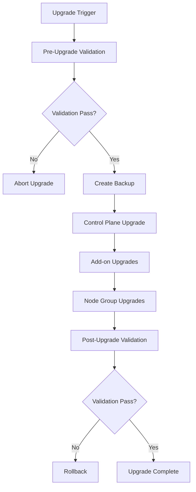

# EKS Upgrade Guide

## Automated EKS Cluster Upgrade Management

This guide provides comprehensive information on automated EKS cluster upgrades, including control plane, add-ons, and node group upgrades.

## Overview

The Enterprise EKS Cluster Automation Platform provides automated, zero-downtime upgrades for:
- EKS Control Plane
- EKS Add-ons
- Node Groups
- Applications and Workloads

## Upgrade Strategy

### Upgrade Types

#### 1. Control Plane Upgrade
- Automatic Kubernetes version upgrade
- Preserves all cluster configurations
- Zero downtime for properly configured workloads
- Maintains API compatibility

#### 2. Node Group Upgrade
- Rolling update strategy
- Drains nodes gracefully
- Respects Pod Disruption Budgets
- Handles spot and on-demand instances

#### 3. Add-on Upgrade
- CoreDNS, kube-proxy, VPC CNI
- Maintains compatibility matrix
- Rollback capability
- Health validation

### Upgrade Process



## Pre-Upgrade Validation

### Compatibility Checks
- Kubernetes version compatibility
- Add-on version compatibility
- Application compatibility
- Custom resource definitions

### Health Checks
- Cluster health assessment
- Node health validation
- Application readiness
- Resource availability

### Backup Creation
- ETCD snapshots
- Configuration backups
- Application state backup
- Persistent volume snapshots

## Upgrade Configuration

### Upgrade Policy
```yaml
apiVersion: v1
kind: ConfigMap
metadata:
  name: upgrade-policy
data:
  upgrade-strategy: |
    version: "1.29"
    maintenance-window:
      start: "02:00"
      end: "04:00"
      timezone: "UTC"
      days: ["Sunday"]
    
    control-plane:
      auto-upgrade: true
      max-unavailable: "10%"
    
    node-groups:
      strategy: "rolling-update"
      max-unavailable: "25%"
      max-surge: "1"
    
    add-ons:
      auto-upgrade: true
      preserve-settings: true
    
    rollback:
      enabled: true
      timeout: "30m"
```

### Terraform Configuration
```hcl
module "eks_upgrade" {
  source = "./modules/eks-upgrade"

  cluster_name     = "my-cluster"
  target_version   = "1.29"
  
  upgrade_policy = {
    maintenance_window = {
      start = "02:00"
      end   = "04:00"
      days  = ["Sunday"]
    }
    
    control_plane = {
      auto_upgrade     = true
      max_unavailable  = "10%"
    }
    
    node_groups = {
      strategy         = "rolling-update"
      max_unavailable  = "25%"
      max_surge        = "1"
    }
    
    rollback = {
      enabled = true
      timeout = "30m"
    }
  }
}
```

## Upgrade Commands

### CLI Commands

#### Check Available Upgrades
```bash
# Check cluster upgrade availability
eks-platform upgrade check my-cluster

# Get detailed upgrade plan
eks-platform upgrade plan my-cluster --target-version 1.29
```

#### Start Upgrade
```bash
# Upgrade with default policy
eks-platform upgrade start my-cluster --version 1.29

# Upgrade with custom policy
eks-platform upgrade start my-cluster \
  --version 1.29 \
  --policy upgrade-policy.yaml \
  --maintenance-window "02:00-04:00"

# Upgrade specific component
eks-platform upgrade start my-cluster \
  --component control-plane \
  --version 1.29
```

#### Monitor Upgrade
```bash
# Get upgrade status
eks-platform upgrade status my-cluster

# Follow upgrade progress
eks-platform upgrade logs my-cluster --follow

# Get detailed upgrade report
eks-platform upgrade report my-cluster
```

### API Endpoints

#### Check Upgrades
```http
GET /api/v1/clusters/{clusterName}/upgrades
```

Response:
```json
{
  "current_version": "1.28",
  "available_versions": ["1.29", "1.30"],
  "recommended_version": "1.29",
  "upgrade_path": [
    {
      "from": "1.28",
      "to": "1.29",
      "breaking_changes": [],
      "estimated_duration": "45m"
    }
  ]
}
```

#### Start Upgrade
```http
POST /api/v1/clusters/{clusterName}/upgrade
Content-Type: application/json

{
  "target_version": "1.29",
  "maintenance_window": {
    "start": "2024-01-15T02:00:00Z",
    "end": "2024-01-15T04:00:00Z"
  },
  "policy": {
    "rollback_enabled": true,
    "max_unavailable": "25%"
  }
}
```

## Automated Upgrades

### GitHub Actions Workflow
```yaml
name: EKS Cluster Upgrade
on:
  schedule:
    - cron: '0 2 * * 0'  # Weekly on Sunday 2 AM
  workflow_dispatch:
    inputs:
      cluster_name:
        description: 'Cluster name to upgrade'
        required: true
      target_version:
        description: 'Target Kubernetes version'
        required: true

jobs:
  upgrade-cluster:
    runs-on: ubuntu-latest
    steps:
      - name: Checkout
        uses: actions/checkout@v3
        
      - name: Configure AWS
        uses: aws-actions/configure-aws-credentials@v2
        with:
          aws-access-key-id: ${{ secrets.AWS_ACCESS_KEY_ID }}
          aws-secret-access-key: ${{ secrets.AWS_SECRET_ACCESS_KEY }}
          aws-region: us-west-2
          
      - name: Check Upgrade Eligibility
        run: |
          eks-platform upgrade check ${{ github.event.inputs.cluster_name }}
          
      - name: Create Backup
        run: |
          eks-platform backup create ${{ github.event.inputs.cluster_name }}
          
      - name: Start Upgrade
        run: |
          eks-platform upgrade start \
            ${{ github.event.inputs.cluster_name }} \
            --version ${{ github.event.inputs.target_version }} \
            --wait
            
      - name: Validate Upgrade
        run: |
          eks-platform upgrade validate ${{ github.event.inputs.cluster_name }}
          
      - name: Notify on Failure
        if: failure()
        uses: 8398a7/action-slack@v3
        with:
          status: ${{ job.status }}
          webhook_url: ${{ secrets.SLACK_WEBHOOK }}
```

### Terraform Automation
```hcl
resource "aws_lambda_function" "eks_upgrade_scheduler" {
  filename         = "upgrade-scheduler.zip"
  function_name    = "eks-upgrade-scheduler"
  role            = aws_iam_role.lambda_role.arn
  handler         = "index.handler"
  runtime         = "python3.9"
  timeout         = 900

  environment {
    variables = {
      CLUSTER_NAME = var.cluster_name
      TARGET_VERSION = var.target_version
    }
  }
}

resource "aws_cloudwatch_event_rule" "upgrade_schedule" {
  name                = "eks-upgrade-schedule"
  description         = "Trigger EKS upgrade"
  schedule_expression = "cron(0 2 ? * SUN *)"
}

resource "aws_cloudwatch_event_target" "lambda_target" {
  rule      = aws_cloudwatch_event_rule.upgrade_schedule.name
  target_id = "TriggerUpgrade"
  arn       = aws_lambda_function.eks_upgrade_scheduler.arn
}
```

## Rollback Procedures

### Automatic Rollback
- Triggered on upgrade failure
- Health check failures
- Application readiness failures
- Custom metric thresholds

### Manual Rollback
```bash
# Check rollback eligibility
eks-platform rollback check my-cluster

# Perform rollback
eks-platform rollback start my-cluster --reason "Application compatibility issues"

# Get rollback status
eks-platform rollback status my-cluster
```

### Rollback Process
1. Stop current upgrade
2. Restore from backup
3. Revert node groups
4. Validate cluster health
5. Verify application functionality

## Monitoring and Alerting

### Upgrade Metrics
- Upgrade duration
- Success/failure rates
- Rollback frequency
- Application downtime

### Alerting Rules
```yaml
groups:
- name: eks-upgrade-alerts
  rules:
  - alert: UpgradeInProgress
    expr: eks_upgrade_status{status="in_progress"} == 1
    for: 0m
    labels:
      severity: info
    annotations:
      summary: "EKS upgrade in progress for {{ $labels.cluster }}"
      
  - alert: UpgradeFailed
    expr: eks_upgrade_status{status="failed"} == 1
    for: 0m
    labels:
      severity: critical
    annotations:
      summary: "EKS upgrade failed for {{ $labels.cluster }}"
      
  - alert: UpgradeTakingTooLong
    expr: eks_upgrade_duration_minutes > 120
    for: 0m
    labels:
      severity: warning
    annotations:
      summary: "EKS upgrade taking longer than expected"
```

## Best Practices

### Planning
1. Test upgrades in non-production first
2. Review breaking changes
3. Plan maintenance windows
4. Communicate with stakeholders

### Execution
1. Create comprehensive backups
2. Monitor during upgrade
3. Validate thoroughly
4. Have rollback plan ready

### Post-Upgrade
1. Validate all applications
2. Monitor for issues
3. Update documentation
4. Plan next upgrade

## Troubleshooting

### Common Issues

#### Control Plane Upgrade Stuck
```bash
# Check upgrade logs
kubectl logs -n kube-system deployment/cluster-autoscaler

# Check AWS CloudTrail for API errors
aws logs filter-log-events \
  --log-group-name /aws/eks/my-cluster/cluster \
  --start-time 1609459200000
```

#### Node Group Upgrade Issues
```bash
# Check node readiness
kubectl get nodes

# Check pod eviction status
kubectl get pods --all-namespaces --field-selector=status.phase=Pending

# Check node group status
aws eks describe-nodegroup \
  --cluster-name my-cluster \
  --nodegroup-name my-nodegroup
```

#### Add-on Compatibility Issues
```bash
# Check add-on status
aws eks describe-addon \
  --cluster-name my-cluster \
  --addon-name vpc-cni

# Check add-on logs
kubectl logs -n kube-system daemonset/aws-node
```

### Emergency Procedures
1. Stop upgrade immediately
2. Assess cluster state
3. Initiate rollback if needed
4. Escalate to on-call team
5. Communicate to stakeholders

## Support

For upgrade-related issues:
- **Emergency**: Page on-call team
- **Email**: eks-upgrade-team@company.com
- **Slack**: #eks-upgrades
- **Documentation**: Internal upgrade runbooks

Remember: Always test upgrades in non-production environments first! 🔄
